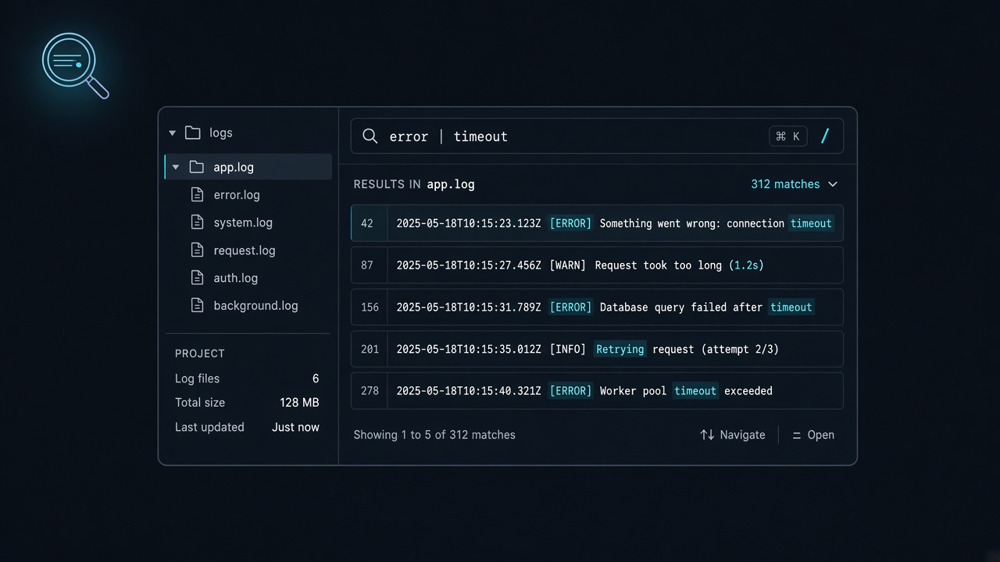

<div align="center">
  
  <h1>Insight Log</h1>
  <p><b>轻量级跨平台本地日志搜索桌面应用</b></p>
  <p>在目录与压缩包中快速检索日志，支持管道过滤、正则与内置查看器。</p>

  <p>
    <a href="https://github.com/zyf8827/insight-log/releases/tag/v0.1.0"></a>
    <a href="https://zyf8827.github.io/insight-log-website/"></a>
    <a href="https://github.com/zyf8827/insight-log/blob/main/LICENSE"></a>
    <a href="https://github.com/zyf8827/insight-log/actions/workflows/build.yml"></a>
    <a href="https://nodejs.org"></a>
    <a href="https://www.rust-lang.org"></a>
    <a href="https://tauri.app"></a>
  </p>

  <p>
    🌐 <b>官方网站</b>：<a href="https://zyf8827.github.io/insight-log-website/">https://zyf8827.github.io/insight-log-website/</a>
  </p>
</div>

---

`insight-log` 基于 **Tauri 2 + React + TypeScript + Rust**，面向需要在本机快速翻日志的开发者与运维同学。选择一个目录后即可搜索普通文本日志，以及 ZIP / TAR / GZ / 7z 压缩包内的内容，无需先手动解压。

<p align="center">
  
</p>

---

## 核心特性

- **搜索优先清爽交互**：主搜索条占据视觉中心，高级筛选折叠收纳，侧边文件树可随需展开或收起，大屏小屏主体空间均留给搜索结果。
- **高性能虚拟滚动**：基于 `@tanstack/react-virtual` 动态高度虚拟列表，万级匹配日志流畅滚动，无 DOM 膨胀卡顿。
- **按文件分组与紧凑行视图**：结果按文件聚合展示，支持整组一键折叠；等宽代码行号列，高亮命中片段并弱化上下文。
- **结果内二次即时过滤**：直接在前端快速过滤当前结果（按路径或行内容），毫秒级响应，无需重搜。
- **管道式多条件过滤**：`error | timeout | 500` 表示同一行须同时满足全部条件（逻辑 AND，不是 OR）。
- **字面量 / 正则**：默认按字面量匹配并自动转义；打开「正则表达式」开关后使用 Rust `regex` 语法。
- **原生支持压缩包**：按文件头魔数识别 ZIP、TAR、GZ（含 `.tar.gz`）、7z，无需先解压。
- **文件过滤**：支持 glob 包含 / 排除，例如 `**/*.log`、`**/*.tmp`。
- **上下文与合并**：匹配结果附带前后上下文；同文件中相邻块会合并，并保留高亮。
- **内置查看器**：可在应用内按行定位浏览命中文件，或直接浏览压缩包内子条目。
- **路径沙箱**：文件读取限制在当前选定的搜索根目录内，拒绝路径穿越。

---

## 局限（请先读）

- 压缩格式目前支持 **ZIP / TAR / GZ / 7z**（仅限未加密归档），**明确不支持 RAR**，亦不支持带密码加密的压缩包。
- 为控制内存占用：单文件搜索上限 **100MB**；压缩包单条目解压上限 **20MB**、累计解压上限 **100MB**；超限会跳过并在控制台提示。
- 这是个人开源的桌面工具，功能以实际代码为准，欢迎 Issue / PR。

---

## 快速开始

### 依赖

- Node.js ≥ 20
- pnpm 10+
- Rust 稳定版（推荐 `rustup`）
- 平台依赖：Linux 需 `libgtk-3-dev`、`libwebkit2gtk-4.1-dev`；Windows 需 WebView2；macOS 需 Xcode Command Line Tools。Windows 另提供绿色版便携包 `insight-log_0.1.0_x64_portable.zip`（解压即运行，见 [Releases](https://github.com/zyf8827/insight-log/releases/tag/v0.1.0)）

### 开发运行

```bash
git clone https://github.com/zyf8827/insight-log.git
cd insight-log
pnpm install
pnpm run dev:app
# 或: ./scripts/dev.sh
```

### 构建

```bash
# 仅生成可执行文件（更快，便于自测）
pnpm run build:app

# 生成系统安装包
pnpm run build:bundle
# 或: ./scripts/build.sh --bundle
```

### 校验

```bash
pnpm run typecheck
cargo test --manifest-path src-tauri/Cargo.toml
```

---

## 搜索语法

| 写法 | 含义 |
| :--- | :--- |
| `timeout` | 字面量搜索（默认） |
| `error \| database \| connection` | 同一行同时包含全部关键词（AND） |
| `(ERROR\|WARN)-\d+` | 打开正则开关后的正则示例 |
| 大小写开关 | 控制是否区分大小写 |
| 包含 / 排除 | glob，如 `**/*.log` |

> 注意：界面里的 `|` 是**链式过滤（AND）**，不是「或」。

---

## 仓库结构

```text
insight-log/
├── src/                 # React 前端（搜索 UI、文件树、查看器）
├── src-tauri/           # Rust / Tauri 后端（搜索、归档、文件读取）
├── scripts/             # 开发与各平台构建脚本
├── docs/
│   ├── assets/          # README 用 logo / hero
│   └── SPEC.md          # 简要规格说明
├── CONTRIBUTING.md
├── SECURITY.md
└── LICENSE
```

---

## 文档与相关站点

- [官方网站 (Website)](https://zyf8827.github.io/insight-log-website/)
- [官网源码仓库 (insight-log-website)](https://github.com/zyf8827/insight-log-website)
- [贡献指南 (CONTRIBUTING.md)](CONTRIBUTING.md)
- [规格说明 (docs/SPEC.md)](docs/SPEC.md)
- [安全说明 (SECURITY.md)](SECURITY.md)
- [Agent 协作笔记 (AGENTS.md)](AGENTS.md)

---

## 许可证

本项目基于 [MIT License](LICENSE) 开源。
